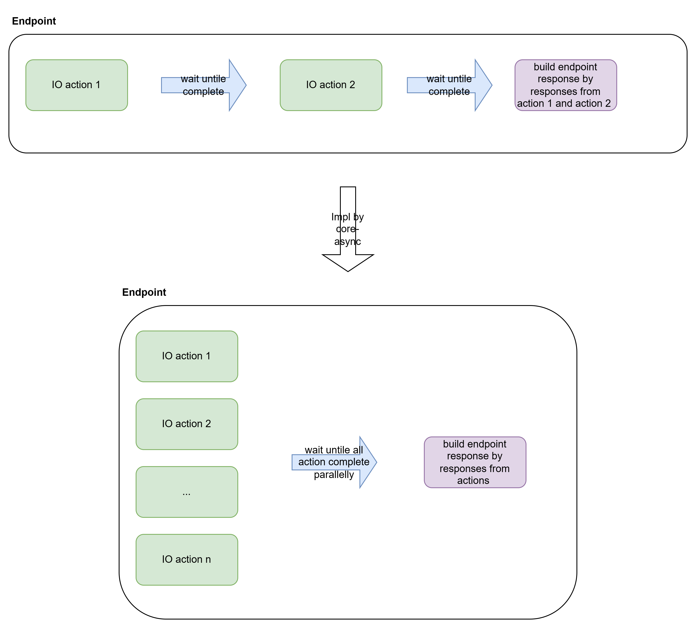

# core-async
core-async
## Project Objectives

One interface’s implementation will commonly have multiple parallel IO operations or API calls. 
However, based on the core-ng framework, our current implementation is that we have to wait until all the serial actions are finished before using responses to construct the API response. 
This means we can not make full use of CPU and memory, and the endpoints' elapsed time is too long.

This project is intended to create a library to simplify the coding of async flow. 
It will make full use of CPU and memory, by making IO actions or API calls parallel and asynchronously. 
Using mapping or reducing actions to combine all responses to a new structure as the response of the endpoint you define, until all actions and API calls are finished parallel and asynchronously.

## Applicable Scenarios
1. Make endpoints that handle multiple IO actions to be responsive
2. Endpoints intend to practice [reactive programming](https://en.wikipedia.org/wiki/Reactive_programming)

## Benefits
1. Make full use of CPU and memory
2. Make actions parallel and asynchronous
3. Easy to practice [reactive programming](https://en.wikipedia.org/wiki/Reactive_programming)

## Scope

### Must Have
1. MVP version of the library release
2. Unit tests cover all the main logic
3. Metrics supporting
4. User manual book

### Nice to have
1. Project practice
2. Load testing for library

## Milestones And Deadlines

| Milestone   | Deadline   | Status                                   |
|--------|------------|------------------------------------------|
| Requirements investigation   | 2025-04-13 | IN PROGRESS |
| Code implementation  | 2025-04-25 | IN PROGRESS |
| Unit test covering  | 2025-04-25 | IN PROGRESS |
| Core-ng logging metrics implementation  | 2025-05-16 | NOT STARTED |
| Load Testing  | 2025-05-23 | NOT STARTED                              |
| User manual book | 2025-05-23 | NOT STARTED                              |
| Demo project implementation | 2025-05-23 | NOT STARTED                              |
| Code review | 2025-05-30 | NOT STARTED                              |
| Publish the MVP version | 2025-06-06 | NOT STARTED                              |
| Wonder project practice with core-async library | 2025-06-30 | NOT STARTED                              |

## Project POC
POC code to see [here](https://github.com/food-truck/blueapron-project/pull/409)